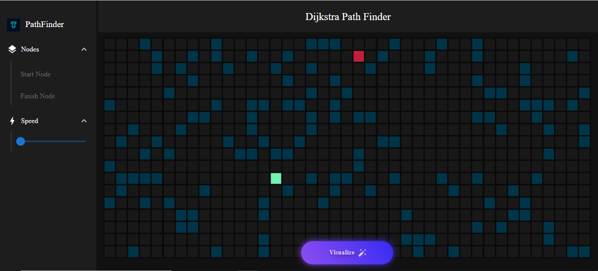

#Path Finder Using Dijkstra Algorithm

1)This Application uses Dijkstra Algorithm to find the Path between the Start Node and End Node.

2)It gives a different maze pattern everytime the app resets.

3)Start Node and Finish Node options provide user with a functionality to choose their favourite node position.

4)Clicking on empty nodes can set a wall and user can set a maze pattern of his/her choice.

5)Speed bar provides you to adjust the maze solving speed.
